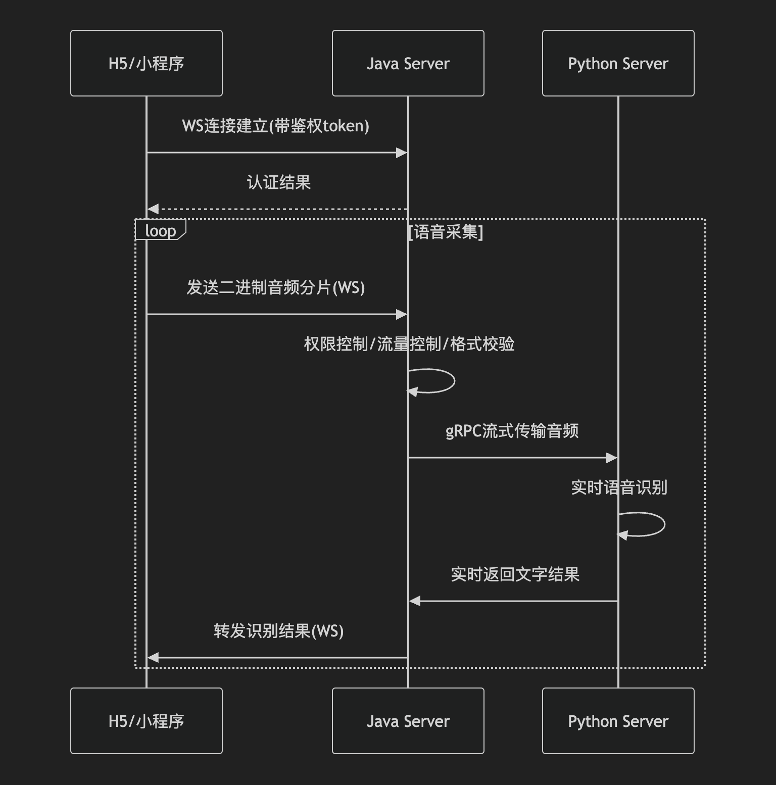
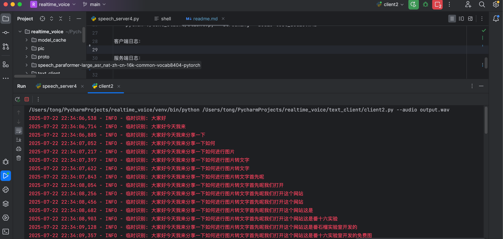
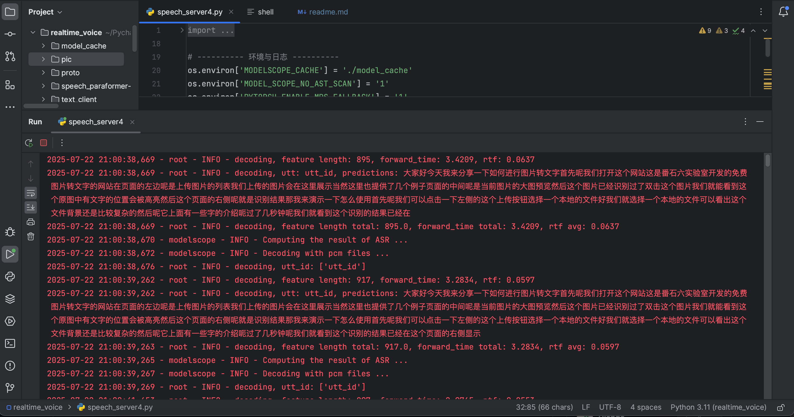

# 项目介绍



# 版本功能
server-3 client-1 
    基础识别
server-4 client-2 
    基础识别（含标点）
server-5 client-2
    去掉了标点
    对音频使用VAD (语音活动检测) 进行智能分片的策略
    # 立即触发条件（最快0.5 秒）：
    #     当request.interim_results = True（请求中间结果）且缓冲区有 ≥0.5秒 音频时
    #     这是最快获取结果的路径，适合需要实时反馈的场景
    # 常规触发条件（约2秒）：
    #     距离上次识别 ≥2秒（segment_duration）时触发
    #     这是标准情况，平衡了延迟和识别准确性的权衡
    # 保护性触发条件（最长3秒）：
    #     当缓冲区积累到 ≥3秒（segment_duration * 1.5）时强制处理
    #     这是防止缓冲区无限增长的安全机制
server-6 client-2
    计划新增中间识别结果
    每一秒返回实时识别结果
    每次停顿返回阶段性最终识别结果

# TODO List
1. 添加标点，为了提高速度，应该在识别结束的时候添加标点

# 测试方式

1. 启动python服务
    python speech_server3.py
2. 启动python client进行测试
    python ./text_client/client.py --streaming --audio test_audio.m4a
    python3.11 ./text_client/client.py --streaming --audio test_audio.m4a

客户端日志：


服务端日志：


# 常用命令

pip freeze > requirements.txt

linux环境部署办法

sudo vi /etc/systemd/system/realtime_py.service

sudo tee /etc/systemd/system/realtime_py.service <<'EOF'
[Unit]
Description=RealTime Text Speech Server
After=network.target

[Service]
Type=simple
User=root
WorkingDirectory=/root/server/real_time_text/py
ExecStart=/bin/bash -c 'source /root/server/real_time_text/py/bin/activate && exec /root/server/real_time_text/py/run.sh start'
Restart=on-failure
RestartSec=5s
Environment=PATH=/usr/local/sbin:/usr/local/bin:/usr/sbin:/usr/bin:/root/bin
Environment=PYTHONPATH=/root/server/real_time_text/py

[Install]
WantedBy=multi-user.target
EOF

sudo systemctl daemon-reload # 重新加载 Systemd 配置

sudo systemctl start realtime_py      # 立即启动
sudo systemctl enable realtime_py     # 开机自启

sudo systemctl status realtime_py #检查服务状态

sudo systemctl stop realtime_py       # 停止服务
sudo systemctl restart realtime_py    # 重启服务
sudo systemctl disable realtime_py    # 禁用开机自启
sudo systemctl status realtime_py    # 禁用开机自启

激活虚拟环境（需要手动操作的场景）
source  /home/tongyuangang/server/realetime_voice/bin/activate

